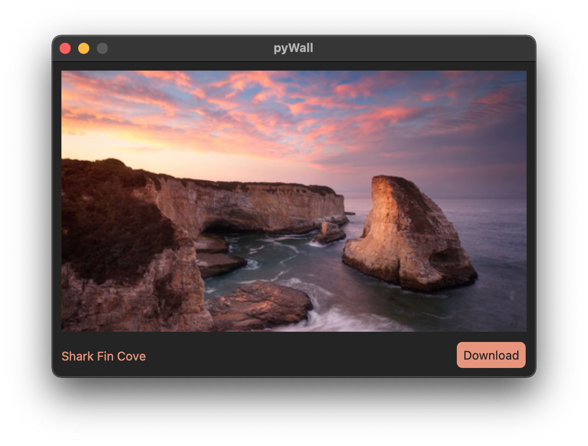

# pyWall
[CustomTkinter](https://github.com/TomSchimansky/CustomTkinter) UI to interact with [TimothyYe/bing-wallpaper API](https://github.com/TimothyYe/bing-wallpaper)

  
  

## Implemented:
* Preview
* Download

## Notes:
Made for educational purposes
